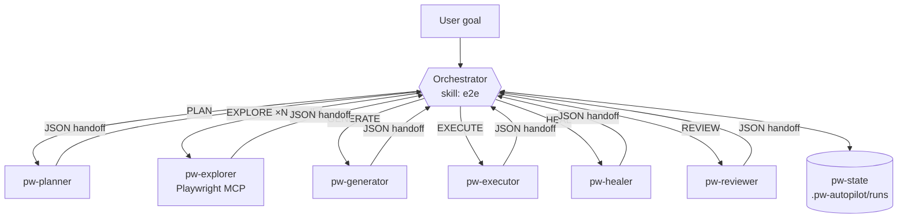
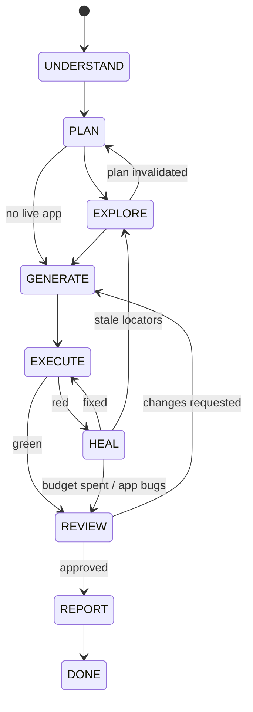

# 🎭 Playwright Autopilot — agentic E2E testing plugin for Claude Code

An orchestrator agent + six specialist subagents that **plan, explore, write, run, heal and review** Playwright end-to-end tests for any web app — with a transparent reasoning lifecycle you can audit.

```
/playwright-autopilot:e2e https://demo.myapp.com checkout flow with coupon codes
```

## Why
Most "AI writes tests" tools guess selectors and stop at the first green run. Autopilot:
- **Looks at the real app** (Playwright MCP) before writing a single locator
- **Runs what it writes** and classifies every failure by root cause
- **Heals without cheating** — never deletes assertions or adds sleeps to go green
- **Reviews itself** against a 16-point quality gate with plan traceability
- **Adapts to your repo** — detects TS/JS, package manager, POM/fixture conventions and follows them
- **Logs its reasoning** per phase (`observation → hypothesis → decision → confidence`)

## Architecture



### Reasoning lifecycle



Transitions and the heal budget are **enforced** by `pw-state`, not just suggested in a prompt. See [docs/architecture.md](docs/architecture.md).

## Install

Requirements: Claude Code, Node.js 18+, a web app to test.

```bash
# inside Claude Code
/plugin marketplace add YOUR_GITHUB_USER/playwright-autopilot
/plugin install playwright-autopilot@playwright-autopilot
```

Local development:
```bash
git clone https://github.com/YOUR_GITHUB_USER/playwright-autopilot
claude --plugin-dir ./playwright-autopilot
```

The bundled `.mcp.json` starts `@playwright/mcp` automatically when the plugin is enabled.

## Skills

| Command | What it does |
|---|---|
| `/playwright-autopilot:e2e <goal>` | Full lifecycle: plan → explore → generate → run → heal → review → report |
| `/playwright-autopilot:setup [ts\|js]` | Scaffold/repair Playwright config, fixtures, BasePage, auth setup, `.env.example` |
| `/playwright-autopilot:explore <url>` | Map a live page into verified locators (no tests written) |
| `/playwright-autopilot:generate <scenario>` | Fast path: write + run tests for one scenario; converts Selenium/Cypress/Gherkin |
| `/playwright-autopilot:heal [scope]` | Fix failing/flaky tests with root-cause classification |
| `/playwright-autopilot:review [files]` | Scored quality audit with file:line fixes |
| `/playwright-autopilot:api-testing <spec>` | API, hybrid UI+API and network-mocking tests |
| `/playwright-autopilot:ci [github\|azure\|gitlab\|jenkins]` | Sharded CI pipeline with merged HTML report |
| `/playwright-autopilot:status [runId]` | Current phase, artifacts, reasoning trail; resume a run |
| `locators`, `pom-fixtures` | Reference skills Claude loads automatically while writing code |

Skills also trigger from plain language: *"write playwright tests for the signup page"*, *"my e2e tests broke after the redesign"*.

## Subagents

| Agent | Role | Tools |
|---|---|---|
| `pw-planner` | Risk-ranked scenario plan (`plan.md`) | Read, Write, Glob, Grep, Bash, WebFetch |
| `pw-explorer` | Drives a real browser, writes verified `pagemap/*.json` | all (incl. Playwright MCP) |
| `pw-generator` | POM + fixtures + specs matching repo style | Read, Write, Edit, Bash… |
| `pw-executor` | Runs tests, classifies failures (fast model) | Read, Bash, Glob, Grep |
| `pw-healer` | Minimal verified fixes, escalates real app bugs | Read, Edit, Write, Bash… |
| `pw-reviewer` | Independent 16-point quality gate | read-only |

## Helper CLIs (on PATH while the plugin is enabled)

| CLI | Purpose |
|---|---|
| `pw-detect` | JSON facts about the project's Playwright setup |
| `pw-state` | Lifecycle state machine + reasoning log |
| `pw-results` | Compacts a Playwright JSON report into a classified failure digest |

## Guardrail hook
A `PostToolUse` hook (`hooks/spec-guard.mjs`) inspects every spec/page-object file Claude writes and bounces back anti-patterns: `waitForTimeout`, `page.$`, positional XPath/CSS, `expect(await …isVisible())`, `.only`, and hard-coded credentials.

## Run artifacts
```
.pw-autopilot/runs/<runId>/
  state.json      phase, history, heal budget, artifacts
  reasoning.md    human-readable decision trail
  plan.md         scenarios with priorities and traceability IDs
  pagemap/*.json  verified locators per page
  review.md       quality scorecard
  report.md       final summary
```
Commit `plan.md`/`report.md` if you want traceability in your repo; add `.pw-autopilot/` to `.gitignore` otherwise.

## Configuration
| Env var | Default | Meaning |
|---|---|---|
| `PW_AUTOPILOT_MAX_HEAL` | `3` | Heal iterations before escalating |
| `BASE_URL` | – | App under test |
| `E2E_USER` / `E2E_PASSWORD` | – | Credentials read by tests and explorer (never written to files) |

## Contributing
PRs welcome — add a skill under `skills/<name>/SKILL.md` or an agent under `agents/`. Run `node tests/validate.mjs` before pushing. See [CONTRIBUTING.md](CONTRIBUTING.md).

## License
MIT

## Publishing your fork
```bash
git init && git add . && git commit -m "feat: playwright-autopilot v1.0.0"
git update-index --chmod=+x bin/pw-state bin/pw-results bin/pw-detect hooks/spec-guard.mjs   # needed when committing from Windows
git branch -M main
git remote add origin https://github.com/YOUR_GITHUB_USER/playwright-autopilot.git
git push -u origin main
```
Replace `YOUR_GITHUB_USER` in `README.md` and `.claude-plugin/plugin.json` first.
